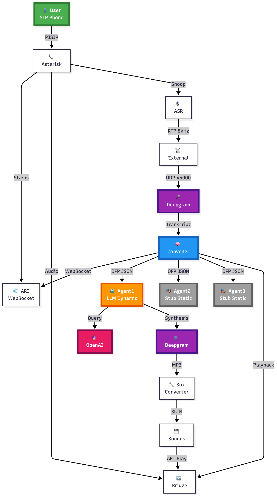

# Asterisk OFP - Multi-Agent AI Voice System

Concept-ready Agentic AI platform built on Asterisk PBX with OFP (Open Voice Network) protocol compliance.

## Overview

This project demonstrates a **multi-agent AI voice system** that orchestrates specialized AI agents in a conference call environment, featuring:

- 🎤 Real-time speech recognition (Deepgram ASR)
- 🤖 Dynamic AI responses (OpenAI GPT-4 + Elevenlabs TTS)
- 🎵 Zero-latency async hold music
- 📋 OFP v1.0.0 protocol implementation
- 🔄 Smart agent floor control management

## Architecture

The system uses a **mixed agent architecture** combining:
- **Agent0**: Async hold music (fills processing time)
- **Agent1**: Dynamic LLM agent (GPT-4 powered responses)
- **Agent2-3**: Static stub agents (prerecorded audio)

See [Architecture Documentation](docs/ARCHITECTURE.md) for complete technical details.

## Key Features

### Zero-Latency User Experience
Agent0 plays "please wait" message asynchronously while Agent1 generates response, eliminating perceived waiting time.

### Smart Playback Management
ARI playback status polling ensures precise audio completion detection without fixed delays.

### OFP Protocol Compliance
Full implementation of Open Voice Network's **[Open Floor Protocol (OFP) v1.0.0](https://github.com/open-voice-interoperability/openfloor-docs/blob/main/specifications/ConversationEnvelope/1.0.0/InteroperableConvEnvSpec.md)**:
- `grantFloor` - Convener grants speaking permission
- `requestFloor` - Agent requests to speak
- `yieldFloor` - Agent releases floor

This implementation follows the **OVON Interoperable Conversation Envelope Specification v1.0.0** for multi-agent voice systems.

## 📋 Call Flow Example

For a complete example of Asterisk MultiAgent call flow with OFP JSON messages, see the [detailed call flow documentation](docs/call_flow_example_2.md).

## Documentation

- [**System Architecture**](docs/ARCHITECTURE.md) - Complete technical overview
- [**OFP Protocol Implementation**](docs/OFP_PROTOCOL.md) - Floor control protocol details
- [**Agent Floor Control**](docs/AGENT_FLOOR_CONTROL.md) - Multi-agent orchestration
- [**Stasis Flow**](docs/STASIS_FLOW.md) - Asterisk ARI integration

## Technology Stack

| Component | Technology |
|-----------|-----------|
| PBX | Asterisk 20+ with ARI |
| Language | Python 3.10+ |
| ASR | Deepgram API |
| LLM | OpenAI GPT-4 |
| TTS | Elevenlabs |
| Protocol | [OFP v1.0.0 (OVON)](https://github.com/open-voice-interoperability/openfloor-docs) |
| Audio | SLIN16/ULAW 8kHz |

## OFP/OVON Compliance

This implementation adheres to the **Open Voice Interoperability Initiative (OVON)** standards:

- **Conversation Envelope Specification**: [v1.0.0](https://github.com/open-voice-interoperability/openfloor-docs/blob/main/specifications/ConversationEnvelope/1.0.0/InteroperableConvEnvSpec.md)
- **Floor Control Events**: `grantFloor`, `requestFloor`, `yieldFloor`
- **Schema Version**: OFP v1.0.0
- **Interoperability**: Standards-compliant agent communication

For more details on the OFP protocol, see:
- [OVON GitHub Repository](https://github.com/open-voice-interoperability/openfloor-docs)
- [Open Voice Network](https://openvoicenetwork.org)

## Status

🚧 **Documentation Phase**: System is fully functional. Source code will be released soon.

Current release: **Documentation v1.0**

## Use Cases

- Multi-agent customer service systems
- AI-powered call centers
- Voice-based booking assistants
- Conference call orchestration
- Interactive voice response (IVR) systems
- OVON-compliant voice assistants

## Contributing

Contributions and feedback welcome! Open an issue or submit a PR.

## License

MIT License - see [LICENSE](LICENSE) file

## Author

**Diego Gosmar**
- GitHub: [@diegogosmar](https://github.com/diegogosmar)

## Acknowledgments

- [**Open Voice Network (OVON)**](https://openvoicenetwork.org) for OFP protocol specification
- [**Open Voice Interoperability Initiative**](https://github.com/open-voice-interoperability) for standardization efforts
- **Asterisk Community** for ARI framework
- **Deepgram** for ASR service
- **Elevenlabs** for TTS service
- **OpenAI** for GPT-4 language model

## References

### OFP/OVON Documentation
- [Conversation Envelope Specification v1.0.0](https://github.com/open-voice-interoperability/openfloor-docs/blob/main/specifications/ConversationEnvelope/1.0.0/InteroperableConvEnvSpec.md)
- [Open Voice Interoperability GitHub](https://github.com/open-voice-interoperability)
- [OVON Website](https://openvoicenetwork.org)

### Asterisk Documentation
- [Asterisk ARI Documentation](https://docs.asterisk.org/Asterisk-REST-Interface/)
- [Asterisk Stasis Applications](https://wiki.asterisk.org/wiki/display/AST/Asterisk+ARI)

---

⭐ **Star this repo if you find it useful!**

💬 **Questions?** Open an issue or join the [OVON Community](https://openvoicenetwork.org)
